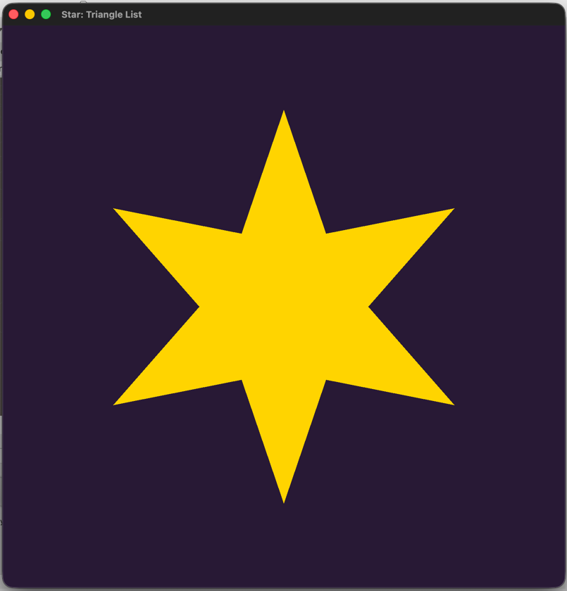

## "Модификация графического приложения: отрисовка звезды в OpenGL"

---

### 1. **Цель работы**
Изучение работы с графическими примитивами в OpenGL, модификация существующего кода для:
- Изменения количества лучей звезды (с 5 на 4 и 6)
- Изменения цвета фона
- Реализации разных методов отрисовки (Triangle List и Triangle Strip)

---

### 2. **Исходные данные**
Исходный код отрисовывал звезду с 5 лучами с использованием:
- OpenGL 3.3 Core Profile
- GLFW для создания окна
- Шейдеров GLSL версии 330
- Цвет фона: темно-фиолетовый (0.15f, 0.1f, 0.2f, 1.0f)
- Золотой цвет звезды

---

### 3. **Выполненные модификации**

#### 3.1. Изменение количества лучей
- **Исходно:** 5 лучей (переменная `rays = 5`)
- **Изменено:** 6 лучей (установлено `rays = 6`)
- **Место изменения:** строка 60 в `main.cpp`

#### 3.2. Изменение цвета фона
- **Исходный цвет:** (0.15f, 0.1f, 0.2f, 1.0f) - темно-фиолетовый
- **Новый цвет:** (0.1f, 0.15f, 0.25f, 1.0f) - темный сине-фиолетовый
- **Место изменения:** строка 79 в `main.cpp`

#### 3.3. Реализация Triangle List
- **Алгоритм:** Для каждого сектора звезды создается треугольник:
    1. Центр (0,0)
    2. Текущая вершина звезды
    3. Следующая вершина звезды
- **Функция:** `generateStarList()` создает массив вершин для отрисовки через `GL_TRIANGLES`
- **Количество треугольников:** `2 * rays` (12 для 6-лучевой звезды)
- **Количество вершин:** `6 * rays` (36 для 6-лучевой звезды)

#### 3.4. Компиляция и запуск
- Создан скрипт `run.sh` для компиляции и запуска
- Используются флаги совместимости для macOS
- Подключены библиотеки GLFW и OpenGL

---

### 4. **Структура программы**

#### 4.1. Шейдеры
- **Вершинный шейдер:** Принимает 2D координаты, передает их дальше
- **Фрагментный шейдер:** Устанавливает золотой цвет (1.0, 0.84, 0.0)

#### 4.2. Генерация геометрии
```cpp
// Triangle List: для каждого луча создаем 2 треугольника
for (int i = 0; i < 2 * rays; ++i) {
    // Центр
    v.push_back(0.0f); v.push_back(0.0f);
    
    // Текущая вершина
    float r1 = (i % 2 == 0) ? outerR : innerR;
    float a1 = i * angleStep - M_PI / 2;
    v.push_back(cos(a1) * r1); v.push_back(sin(a1) * r1);
    
    // Следующая вершина
    float r2 = ((i + 1) % 2 == 0) ? outerR : innerR;
    float a2 = (i + 1) * angleStep - M_PI / 2;
    v.push_back(cos(a2) * r2); v.push_back(sin(a2) * r2);
}
```

#### 4.3. Основной цикл рендеринга
1. Очистка экрана с новым цветом фона
2. Активация шейдерной программы
3. Привязка VAO (Vertex Array Object)
4. Отрисовка через `glDrawArrays(GL_TRIANGLES, ...)`

---

### 5. **Результаты**

#### 5.1. Внешний вид
- **Звезда:** 6 лучей, золотого цвета
- **Фон:** Темный сине-фиолетовый (0.1f, 0.15f, 0.25f, 1.0f)
- **Окно:** 800×800 пикселей, заголовок "Star: Triangle List"

#### 5.2. Особенности реализации Triangle List
- **Преимущества:**
    - Простота понимания и отладки
    - Независимость треугольников
    - Универсальность для любой формы
- **Недостатки:**
    - Избыточность данных (вершины центра дублируются)
    - Больший объем передаваемых данных

#### 5.3. Сравнение с Triangle Strip
*Примечание: В данном коде реализован только Triangle List. Для Triangle Strip потребовалось бы:*
- Иной порядок вершин
- Использование `GL_TRIANGLE_STRIP` в `glDrawArrays`
- Дополнительные индексы или дублирование вершин для разрыва полосы

---

### 6. **Выводы**

1. Успешно модифицирована программа для отрисовки звезды с 6 лучами вместо 5
2. Реализована отрисовка через Triangle List, что обеспечивает гибкость и простоту
3. Изменен цвет фона для лучшего визуального контраста
4. Программа демонстрирует:
    - Работу с шейдерами GLSL
    - Генерацию геометрии программным способом
    - Использование современных возможностей OpenGL (VAO, VBO)
    - Кроссплатформенность (macOS через GLFW)
