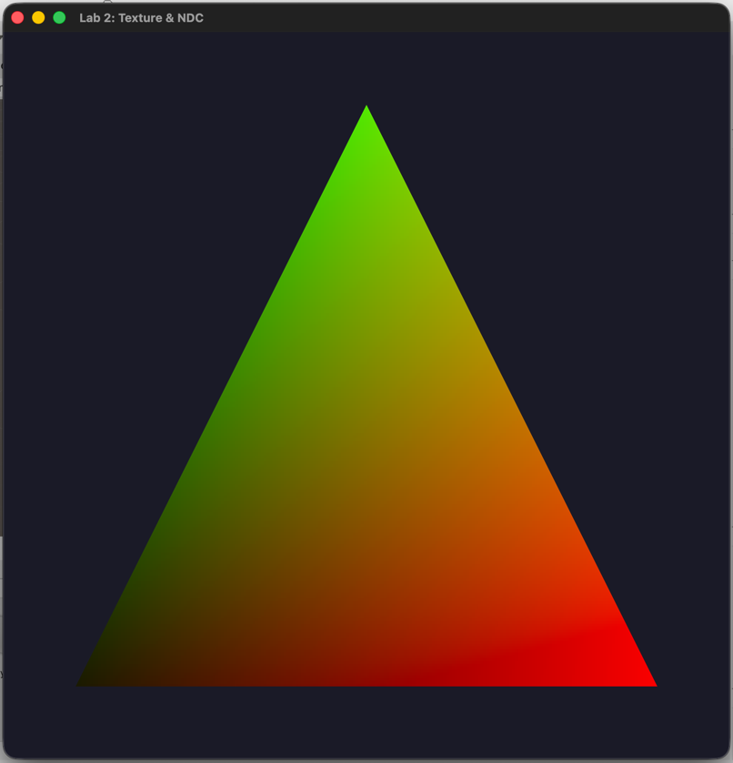

## "Текстурирование треугольника и работа с координатными пространствами в OpenGL"

---

### **1. Вывод треугольника с преобразованием NDC-координат в цвет**

**Цель:** Визуализировать, как нормализованные координаты (NDC) пробегают все значения на экране при преобразовании `0.5*xy + vec2(0.5)`.

**Реализация в шейдере:**
```glsl
FragColor = vec4(NDC_Pos * 0.5 + vec2(0.5), 0.0, 1.0);
```

**Объяснение:**
- **NDC_Pos** - координаты вершин в нормализованном пространстве (-1.0 до 1.0)
- Преобразование `NDC_Pos * 0.5 + vec2(0.5)` переводит координаты из диапазона [-1, 1] в [0, 1]
- **X-координата** → красный канал (R)
- **Y-координата** → зеленый канал (G)
- Синий канал (B) установлен в 0.0, альфа = 1.0

**Результат:**
- Левый нижний угол треугольника: (-0.8, -0.8) → (0.1, 0.1) → темно-зеленый
- Правый нижний угол: (0.8, -0.8) → (0.9, 0.1) → желто-зеленый
- Верхний угол: (0.0, 0.8) → (0.5, 0.9) → ярко-зеленый

**Визуализация:** Треугольник окрашивается плавным градиентом, демонстрируя как координаты NDC пробегают все значения в пределах треугольника.

---

### **2. Визуализация UV-координат**

**Цель:** Отобразить UV-координаты текстуры как цвет.

**Реализация в шейдере:**
```glsl
FragColor = vec4(TexCoord, 0.0, 1.0);
```

**Объяснение:**
- **TexCoord** - текстурные координаты, определенные для каждой вершины
- Вершины имеют следующие UV-координаты:
    - (-0.8, -0.8) → (0.0, 0.0) → черный
    - (0.8, -0.8) → (1.0, 0.0) → красный
    - (0.0, 0.8) → (0.5, 1.0) → фиолетовый (смесь красного и синего)

**Результат:**
- **U-координата** (горизонтальная) → красный канал
- **V-координата** (вертикальная) → зеленый канал
- Получается цветовой градиент, показывающий распределение UV-координат по поверхности треугольника


---

### **3. Вывод собственной процедурной текстуры**

**Цель:** Создать и отобразить собственную текстуру без использования внешних файлов.

**Реализация создания текстуры:**
```cpp
// Генерация шахматной доски 64x64 пикселя
for (int y = 0; y < height; y++) {
    for (int x = 0; x < width; x++) {
        unsigned char c = ((x / 8 + y / 8) % 2 == 0) ? 255 : 100;
        pixels[(y * width + x) * 3 + 0] = 0;   // R = 0
        pixels[(y * width + x) * 3 + 1] = c;   // G = 255 или 100
        pixels[(y * width + x) * 3 + 2] = 150; // B = 150
    }
}
```

**Характеристики текстуры:**
- **Размер:** 64×64 пикселя
- **Формат:** RGB (3 канала)
- **Узор:** Шахматная доска с ячейками 8×8 пикселей
- **Цвета:**
    - Светлые клетки: RGB(0, 255, 150) - яркий зелено-голубой
    - Темные клетки: RGB(0, 100, 150) - темный зелено-голубой

**Использование в шейдере:**
```glsl
FragColor = texture(ourTexture, TexCoord);
```

**Результат:** Треугольник покрывается сгенерированной шахматной текстурой, которая корректно накладывается согласно UV-координатам.

---

### **Технические детали реализации**

#### **Структура вершинных данных:**
```cpp
float vertices[] = {
    // x,    y,     u,   v
    -0.8f, -0.8f,  0.0f, 0.0f,  // левый нижний
     0.8f, -0.8f,  1.0f, 0.0f,  // правый нижний
     0.0f,  0.8f,  0.5f, 1.0f   // верхний
};
```

#### **Система управления режимами:**
- **Клавиша 1** - NDC-координаты как цвет
- **Клавиша 2** - UV-координаты как цвет
- **Клавиша 3** - Текстура

#### **Особенности сборки (macOS Apple Silicon):**
```bash
clang++ -std=c++11 main.cpp \
-I/opt/homebrew/include \
-L/opt/homebrew/lib \
-lglfw -framework OpenGL \
-o texture_demo
```

---

### **Выводы**

1. **NDC-координаты** успешно преобразуются в цветовое пространство, демонстрируя как фрагментный шейдер получает интерполированные значения для каждого пикселя.

2. **UV-координаты** корректно передаются из вершинного шейдера во фрагментный и могут быть использованы как для текстурирования, так и для визуальной отладки.

3. **Процедурная генерация текстуры** успешно реализована, создана уникальная текстура "шахматная доска" сине-зеленых оттенков без использования внешних файлов.

4. Работа демонстрирует полный цикл:
    - Создание и компиляция шейдеров
    - Настройка вершинных данных с атрибутами
    - Генерация и загрузка текстуры в видеопамять
    - Интерактивное переключение между режимами отображения

