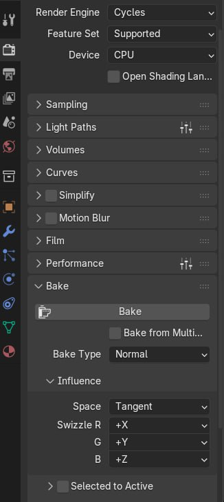
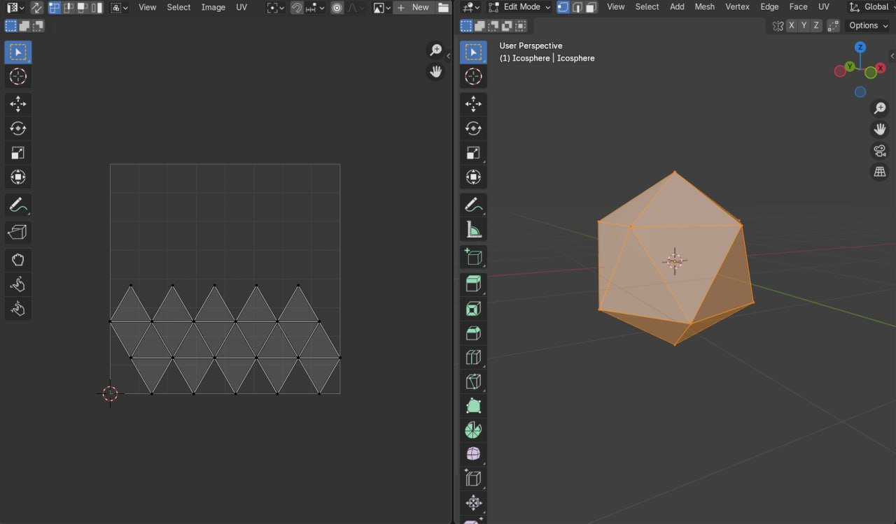
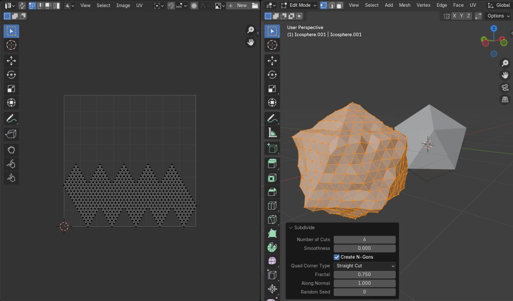
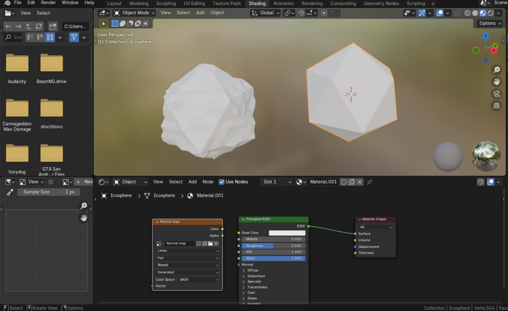
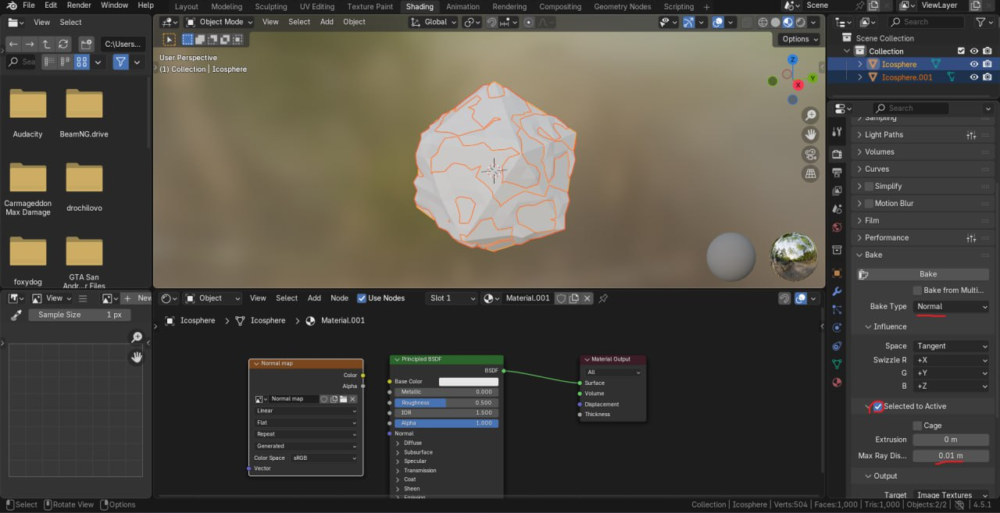
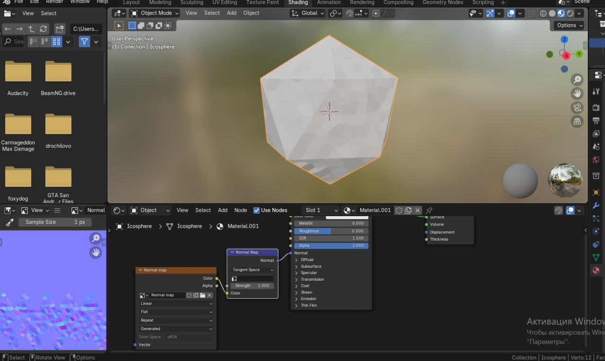

### Процесс генерации high-poly и low-poly моделей, карты нормалей и её применения (мини-отчёт)

На основе предоставленных скриншотов, процесс демонстрирует стандартную технику в Blender для оптимизации моделей с использованием normal mapping. Это включает создание low-poly (низкополигональной) и high-poly (высокополигональной) версий модели на базе икосферы, запекание карты нормалей в tangent space (TBN basis: Tangent, Bitangent, Normal), и применение карты к low-poly модели для имитации деталей high-poly без увеличения количества полигонов. Я опишу шаги поэтапно, опираясь на визуалы из скриншотов.

#### Шаг 1: Создание базовой low-poly модели и UV-развёртки

- Начните с добавления базовой икосферы (Icosphere) в сцену (Add > Mesh > Icosphere). Это low-poly версия с низким количеством вершин (например, subdivisions = 2, verts: ~42, faces: ~80).
- Перейдите в режим Edit Mode и выполните UV-развёртку (UV Unwrap). На скриншоте 2 (левая часть) показана простая UV-карта в форме зигзагообразной полосы из треугольников — это типичная развёртка для сферы, чтобы избежать искажений. Это необходимо для текстур, включая карту нормалей.
- На скриншоте 2 (правая часть) видна low-poly икосфера в 3D-виде с видимыми гранями (faceted shading).

#### Шаг 2: Генерация high-poly модели

- Дублируйте low-poly икосферу (Duplicate: Shift+D), чтобы создать high-poly версию (на скриншотах она обозначена как Icosphere.001).
- Добавьте модификатор Subdivide (Subdivision Surface или Simple Subdivide). На скриншоте 4 (правая часть) показан модификатор Subdivide с Number of Cuts = 6, Smoothness = 0.000, Quad Corner Type = Straight Cut, Fractal = 0.750, Along Normal = 1.000, Random Seed = 0. Это увеличивает количество полигонов (verts: ~504, faces: ~1000+), делая модель более детализированной и "шероховатой" за счёт fractal-эффекта (случайные смещения для имитации неровностей).
- На скриншоте (левая часть) видна UV-развёртка high-poly версии — более плотная зигзагообразная сетка из мелких треугольников, отражающая повышенную детализацию.
- Опционально, примените Displacement или Sculpting для дополнительных деталей (на скриншоте 3 в 3D-виде слева показана bumpy high-poly икосфера, возможно, с noise-дисплейсом).

#### Шаг 3: Настройка материала и подготовка к запеканию карты нормалей

- Перейдите в Shading workspace. Создайте материал для low-poly модели (Material.001).
- В Node Editor добавьте узел Normal Map (Shift+A > Vector > Normal Map). Подключите его к Normal-входу Principled BSDF (на скриншотах 1 и 3 показана зелёная линия от BSDF к Material Output > Surface, и Normal Map подключён к BSDF Normal).
- Создайте новую текстуру для запекания (Image Texture node, New Image, размер 1024x1024 или выше, 32-bit Float для нормалей).
- Убедитесь, что low-poly модель активна (последней выбрана), а high-poly выбрана (Selected). Это для опции "Selected to Active".

#### Шаг 4: Запекание карты нормалей в TBN basis

- В панели Render Properties (Cycles или Eevee) перейдите в раздел Bake.
- Установите Bake Type = Normal.
- Influence > Space = Tangent (это TBN basis: нормали запекаются относительно тангентного пространства модели, где Tangent и Bitangent определяют локальную ориентацию, а Normal — перпендикуляр).
- Swizzle: R = +X, G = +Y, B = +Z (стандарт для OpenGL-формата нормалей в Blender).
- Включите Selected to Active (запекать от выбранных объектов к активному).
- Установите Extrusion = 0.1m (или меньше) для луча проекции, чтобы захватить детали high-poly.
- На скриншотах 1 и 5 показаны эти настройки с красными стрелками. Нажмите Bake — Blender проецирует нормали с high-poly на UV low-poly, создавая карту нормалей.
- Результат: на скриншоте 3 (левая часть, Image Editor) видна запечённая карта нормалей (фиолетово-синие оттенки, типичные для normal maps).

#### Шаг 5: Применение карты нормалей к low-poly модели

- В материале low-poly подключите запечённую Image Texture к Color-входу Normal Map node (Strength = 1.0 для полного эффекта).
- На скриншоте 3 в 3D-виде справа показана low-poly икосфера без карты (faceted), слева — возможно, с применённой картой или high-poly для сравнения. После применения low-poly выглядит детализированной, имитируя high-poly (без реального увеличения полигонов).
- Тестируйте в viewport shading (Shaded или Rendered mode). Если есть артефакты (зелёные/розовые линии), скорректируйте UV или Swizzle (переключите на DirectX-формат, если нужно: G = -Y).

#### Дополнительные замечания

- TBN basis обеспечивает, что нормали работают правильно при деформациях модели (анимация, рендер). Tangent space предпочтителен для игр (Unity/Unreal).
- Сравнение: На скриншоте 3 левая модель (high-poly ~миллионы verts после subdiv) vs. правая (low-poly с normal map ~сотни verts) — оптимизация для производительности.
- Возможные улучшения: Добавьте cage (промежуточную модель) для лучшей проекции, если модели не совпадают идеально; запеките другие карты (AO, displacement).
- Общее время: ~5-10 мин на простую модель, но baking может занять секунды-минуты в зависимости от разрешения.

